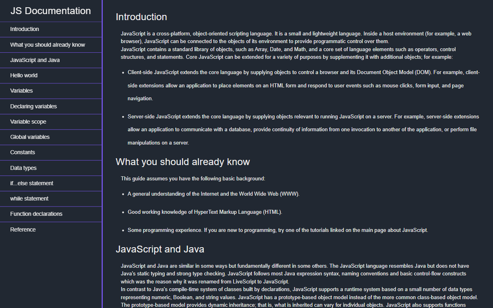

# Technical Documentation Page *(Certification Project)* | FCC Responsive Web Design Certification

**Project 14/20**

A fully responsive JavaScript documentation page built using only HTML and CSS. It mimics a technical documentation layout with a fixed sidebar navigation and structured content sections. This project demonstrates semantic structuring and clean styling for long-form documentation 🧠💻.

---

## 📚 Table of Contents

- [🔎 Overview](#-overview)
  - [📸 Screenshot](#-screenshot)
  - [🔗 Links](#-links)
  - [📌 Features](#-features)
- [🧠 My process](#-my-process)
  - [🛠️ Built with](#️-built-with)
  - [🎓 What I learned](#-what-i-learned)
  - [🔙 Previous Project](#-previous-project)
  - [🔜 Next Project](#-next-project)
- [👤 Author](#-author)
  - [🌐 Connect with Me](#-connect-with-me)
  - [💻 Coding Profiles](#-coding-profiles)

---

## 🔎 Overview

### 📸 Screenshot

### 🔗 Links

 - [🔴 Live Demo](https://dalascript.github.io/technical-documentation-page/)
 - [🗂️ GitHub Repository](https://github.com/DalaScript/technical-documentation-page)

### 📌 Features

 - ✅ Fixed sidebar navigation with smooth scroll
 - ✅ Responsive layout with mobile-friendly design
 - ✅ Organized content with semantic `<section>` and `<article>` tags
 - ✅ Styled code blocks for readability
 - ✅ Highlighted nav links on hover
 - ✅ Clean typography and color scheme for readability
 - ✅ External link to MDN reference

## 🧠 My Process

### 🛠️ Built with

 - HTML5
 - CSS3

### 🎓 What I Learned

 - How to structure a large documentation layout with semantic HTML
 - Styling scrollable and fixed side navigation menus
 - Enhancing code readability with custom-styled `<code>` blocks
 - Organizing content into sections and maintaining visual hierarchy
 - Using CSS variables for scalable theme management

  > 🚀 For me, this project was more about **practice** and gaining additional **experience**,  
  > rather than learning something entirely new.  
  >  
  > 👨‍💻 Since I’m not a beginner and already familiar with these technologies,  
  > I approached it with confidence — and still, I truly **enjoyed working on it**.  
  >  
  > 🎯 Overall, I consider this a very **valuable and enjoyable experience**.

### 🔙 Previous Project

 - Piano | *[Project 13/20]* → [View Repository](https://github.com/DalaScript/piano)

### 🔜 Next Project

 - City Skyline | *[Project 15/20]* → [View Repository](https://github.com/DalaScript/city-skyline)

---

## 👤 Author

### 🌐 Connect with Me

 - [Instagram](https://www.instagram.com/DalaScript)
 - [YouTube](https://www.youtube.com/@DalaScript)

### 💻 Coding Profiles

 - [freeCodeCamp](https://www.freecodecamp.org/DalaScript)
 - [FrontendMentor](https://www.frontendmentor.io/profile/DalaScript)
 - [GitHub](https://github.com/DalaScript)

*🙌 Thanks for checking out my project! More coming soon. Stay tuned 🚀*